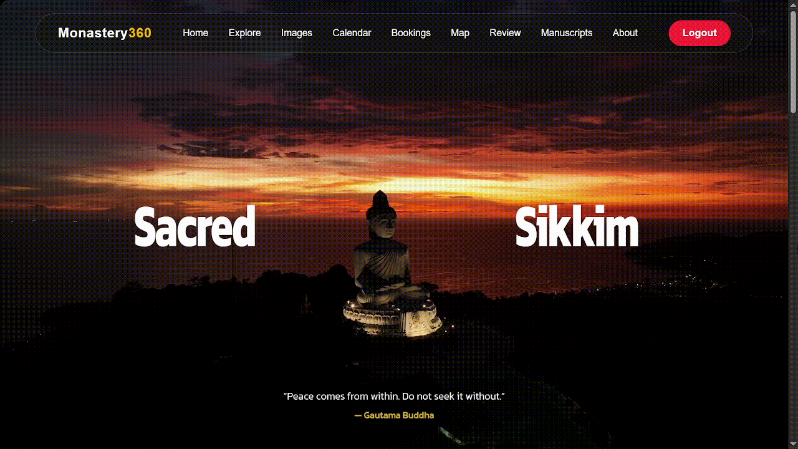
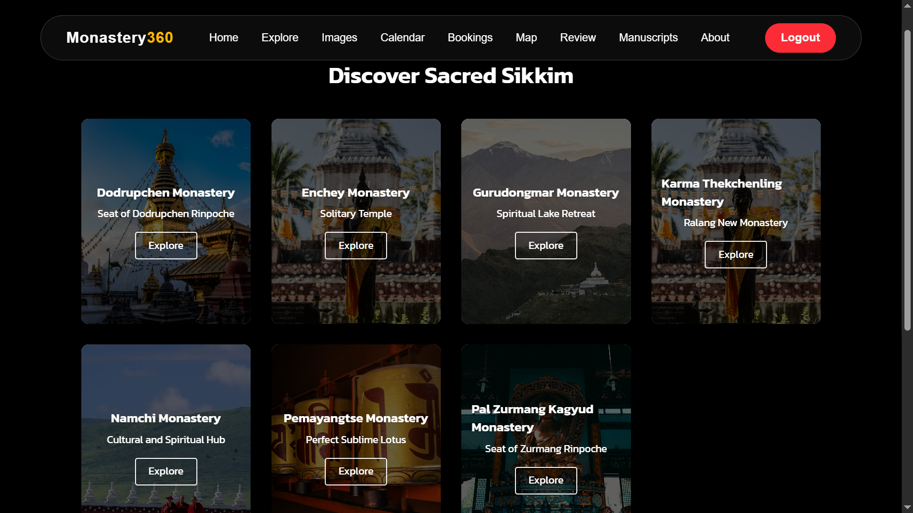
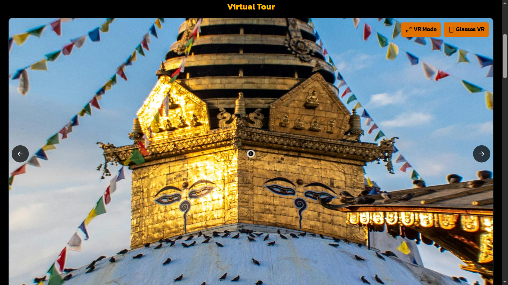
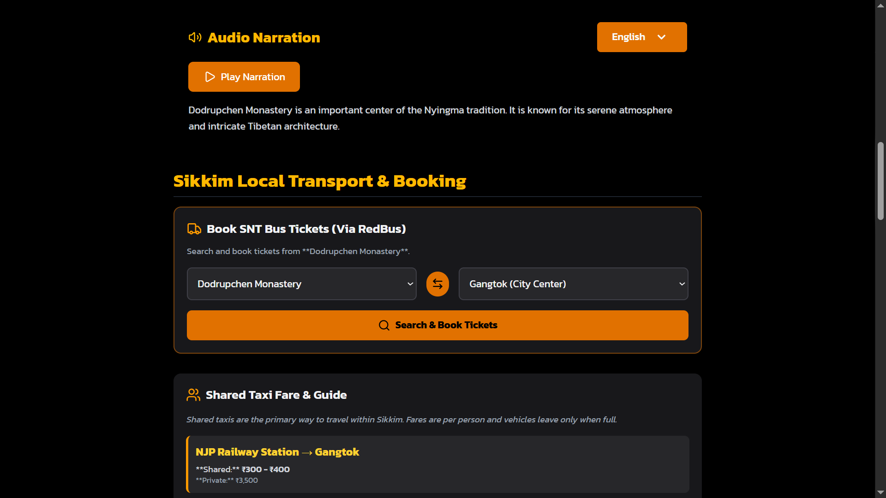
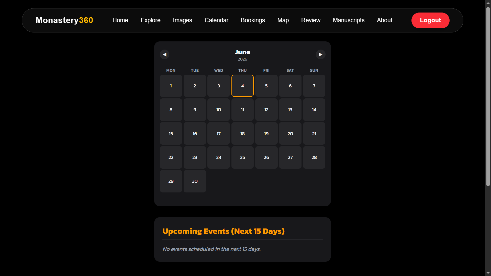
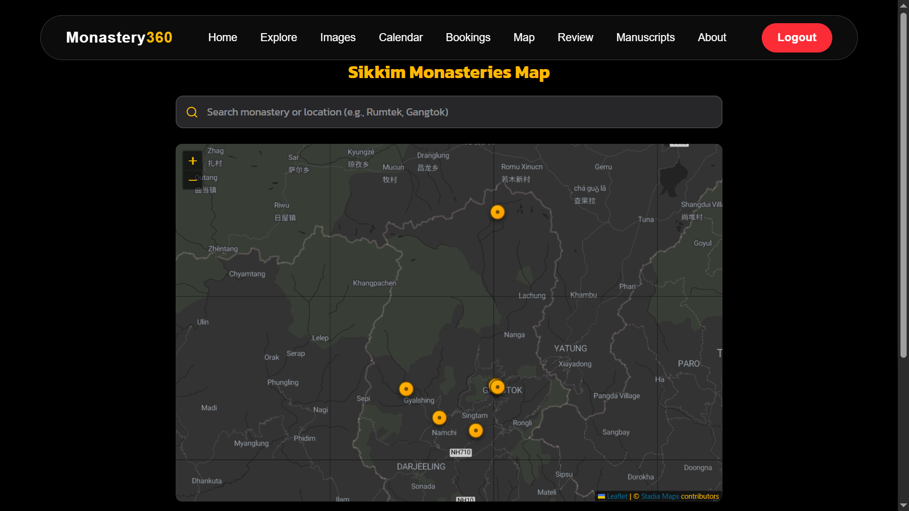

<div align="center">

<br/>

<a href="https://github.com/Madeshmadmax7/SacredSikkim">
  
</a>


<br/>
<br/>


<br/>
<br/>



<br/>

**Monastery360, also known as Sacred Sikkim, is a full-stack heritage exploration platform designed to digitally preserve and showcase the rich spiritual, cultural, and historical legacy of Sikkim's monasteries. Built with React, Spring Boot, Tailwind CSS, and MySQL, the platform delivers immersive virtual experiences, monastery discovery, event tracking, travel assistance, bookings, reviews, and interactive maps through a modern responsive interface.**

<br/>

<p align="center">

<a href="#features">
  
</a>

<a href="#system-architecture">
  
</a>

<a href="#technology-stack">
  
</a>

<a href="#repository-setup">
  
</a>

</p>

</div>

---

## Overview

Monastery360 combines a React frontend, Spring Boot backend, JWT authentication, Tailwind CSS styling, and MySQL database into a unified platform capable of promoting cultural tourism, preserving heritage, enabling monastery exploration, managing visitor bookings, showcasing events, and delivering immersive digital experiences.

<br/>

<br/>

Experience Sikkim's spiritual heritage through immersive monastery exploration, panoramic experiences, interactive maps, cultural events, bookings, reviews, and travel planning tools.

<br/>

<table width="95%">
<tr>

<td width="50%" valign="top">

## Why Monastery360?

- Digital heritage preservation
- Immersive monastery exploration
- Cultural tourism promotion
- Interactive panoramic experiences
- Event discovery and tracking
- Secure booking management
- Real-time travel assistance
- Responsive user experience

</td>

<td width="50%" valign="top">

## Built With

- **Frontend:** React · Tailwind CSS
- **Backend:** Spring Boot · Spring MVC
- **Database:** MySQL
- **Authentication:** JWT
- **Build Tool:** Vite
- **Language:** Java · JavaScript
- **Infrastructure:** GitHub · Maven · NPM

</td>

</tr>
</table>

---

# Features

## Home Experience

<table width="100%">
<tr>
<th width="50%" align="center">Home Dashboard</th>
<th width="50%" align="center">Monastery Explorer</th>
</tr>

<tr>
<td align="center" valign="top">


</td>

<td align="center" valign="top">



</td>
</tr>
</table>

<br/>

The landing experience introduces visitors to Sacred Sikkim through featured monasteries, cultural highlights, heritage stories, testimonials, and seamless navigation.

### Core Capabilities

- Responsive landing page
- Featured monastery showcase
- Heritage storytelling
- Navigation system
- Mobile optimization
- Review highlights
- Interactive UI
- User engagement

---

## Immersive Monastery Experience

<div align="center">

<table width="100%">
<tr>
</tr>

<tr>
<td align="center" valign="top">



</td>

<td align="center" valign="top">



</td>
</tr>
</table>

<br/>

</div>

<br/>

Visitors can access detailed monastery information, historical narratives, panoramic views, immersive virtual experiences, and location-specific travel guidance.

### Experience Features

- Detailed monastery profiles
- Historical information
- VR-style exploration
- Panorama viewer
- Audio narration
- Image galleries
- Cultural insights
- Tourism guidance

---

## Cultural Calendar

<div align="center">



</div>

<br/>

The cultural calendar enables users to discover upcoming monastery events, festivals, ceremonies, and important heritage celebrations across Sikkim.

### Calendar Features

- Event scheduling
- Festival discovery
- Monthly calendar view
- Upcoming events
- Event filtering
- Event details
- Heritage celebrations
- Cultural awareness

---

## Interactive Mapping

<div align="center">



</div>

<br/>

The mapping system helps visitors visualize monastery locations, nearby attractions, transportation routes, and travel accessibility.

### Map Features

- Interactive maps
- Route visualization
- Search functionality
- Nearby attractions
- Transport assistance
- Location filtering
- Navigation support
- Geographic insights

---

## Booking Management

Users can securely manage monastery visit bookings, maintain travel plans, and access booking details through an authenticated dashboard.

### Booking Features

- Online bookings
- QR code generation
- Visitor management
- Booking history
- Secure reservations
- User dashboard
- Schedule planning
- Authentication support

---

## Reviews & Community Feedback

Visitors can share experiences, submit reviews, and contribute feedback that helps improve tourism engagement and community participation.

### Review Features

- Review submission
- User feedback
- Community engagement
- Ratings support
- Visitor experiences
- Review history
- Authenticated posting
- Public review display

---

## Manuscripts & Heritage Preservation


The manuscript section focuses on preserving historical records, cultural documents, and traditional knowledge through digital accessibility.

### Heritage Features

- Manuscript viewing
- Heritage preservation
- Cultural documentation
- Historical archives
- Knowledge sharing
- Educational resources
- Digital accessibility
- Preservation initiatives

---

# System Architecture

```text
 ┌──────────────────────────┐
 │      React Frontend      │
 │  Tailwind CSS Interface  │
 └────────────┬─────────────┘
              │
           REST API
              │
              ▼
 ┌──────────────────────────┐
 │     Spring Boot API      │
 │  Business Logic Layer    │
 │ JWT Authentication       │
 └────────────┬─────────────┘
              │
              ▼
 ┌──────────────────────────┐
 │        MySQL DB          │
 │ Heritage Data Storage    │
 └──────────────────────────┘
```

---

# Technology Stack

| Frontend | Backend | Database | UI Components | Development |
|:---|:---|:---|:---|:---|
| React.js | Spring Boot | MySQL | Leaflet Maps | Maven |
| JavaScript | Spring MVC | MySQL Workbench | Lucide React | ESLint |
| HTML5 | Spring Security | Relational Database | Tailwind CSS | Postman |
| CSS3 | Spring Data JPA | MySQL Server | Pannellum VR | Git |
| Tailwind CSS | Java 21 | SQL Queries | A-Frame | GitHub |

---

# Application Flow

```text
User Exploration
       │
       ▼
React Components
       │
       ▼
REST API Requests
       │
       ▼
Spring Boot Controllers
       │
       ▼
Service Layer
       │
       ▼
Repository Layer
       │
       ▼
MySQL Database
       │
       ▼
Tourism Experience Platform
```

---

# Project Structure

```bash
SacredSikkim/
│
├── sacredsikkim-ui/
│   ├── src/
│   ├── components/
│   ├── pages/
│   ├── services/
│   ├── assets/
│   ├── App.jsx
│   └── main.jsx
│
├── sacredsikkimapi/
│   ├── controller/
│   ├── service/
│   ├── repository/
│   ├── entity/
│   ├── dto/
│   ├── security/
│   └── config/
│
├── screenshots/
│
├── package.json
├── pom.xml
└── README.md
```

---

# Modules

| Module | Description |
|:---|:---|
| Monastery Explorer | Discover monasteries and heritage sites |
| Virtual Experience | Panorama and immersive viewing |
| Cultural Calendar | Event and festival tracking |
| Interactive Maps | Location and route visualization |
| Booking Management | Visit planning and reservations |
| Reviews System | Visitor feedback management |
| Authentication | JWT-based secure access |
| Heritage Archive | Manuscripts and cultural preservation |

---

# Deployment

| Service | Platform |
|:---|:---|
| Frontend | Vercel / Netlify |
| Backend | Render / Railway |
| Database | MySQL |
| Build Tool | Maven + Vite |
| Source Control | GitHub |

---

# Repository Setup

<details>
<summary><b>Installation & Setup</b></summary>

```bash
git clone https://github.com/Madeshmadmax7/SacredSikkim.git

cd SacredSikkim

npm install
```

</details>

---

<details>
<summary><b>Development Server</b></summary>

```bash
npm run dev

http://localhost:5173
```

</details>

---

<details>
<summary><b>Backend Server</b></summary>

```bash
cd sacredsikkimapi

./mvnw spring-boot:run
```

</details>

---

<details>
<summary><b>Production Build</b></summary>

```bash
npm run build

npm run preview
```

</details>

---

# Environment Configuration

Create a `.env` file:

```env
VITE_API_URL=http://localhost:8080/api
```

Backend configuration:

```properties
spring.datasource.url=
spring.datasource.username=
spring.datasource.password=
jwt.secret=
```

---

# API Integration

The frontend communicates with Spring Boot services using REST APIs.

```javascript
import axios from "axios";

const api=axios.create({
  baseURL:import.meta.env.VITE_API_URL
});

export default api;
```

---

# Performance Optimization

- Component-based architecture
- Optimized REST API communication
- JWT authentication caching
- Lazy loading support
- Responsive image optimization
- Efficient database queries
- Fast Vite production builds
- Scalable backend architecture

---

# Browser Support

- Chrome (Latest)
- Firefox (Latest)
- Safari (Latest)
- Edge (Latest)
- Mobile Browsers

---

<div align="center">


<br/>


<br/>

</div>